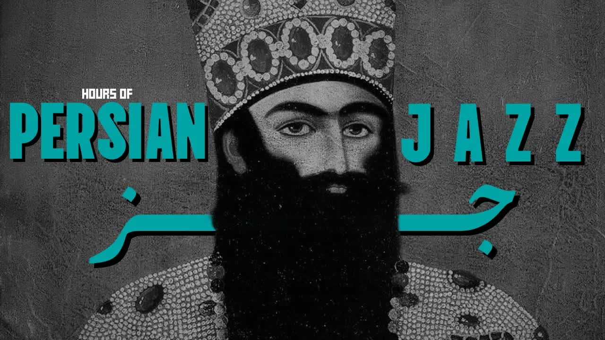

# Hours-of-Persian-Jazz-–-“Emshab-Shabe-Mahtabe-”-(امشب-شب-مهتابه)-Qajar-Classic

  <picture>
    
  </picture>

 

---

## Video Information

| Property | Value |
|----------|-------|
| **Video Name** | `Hours-of-Persian-Jazz-–-“Emshab-Shabe-Mahtabe-”-(امشب-شب-مهتابه)-Qajar-Classic` |
| **Original Link** | [YouTube Video](https://www.youtube.com/watch?v=G3sgvxQCQAM&list=RDG3sgvxQCQAM&start_radio=1) |
| **Total Size** | **3 parts** - **212.32 MB** |
| **Quality** | **audio** |
| **Status** | **Complete (100%)** |
| **Password Protected** | **NO** |

---

## Download Links

> Download **all parts**, then open `Hours-of-Persian-Jazz-–-“Emshab-Shabe-Mahtabe-”-(امشب-شب-مهتابه)-Qajar-Classic.rar` — the other parts are found automatically.

| # | File | Link |
|---|------|------|
| 1 | `Hours-of-Persian-Jazz-–-“Emshab-Shabe-Mahtabe-”-(امشب-شب-مهتابه)-Qajar-Classic.part1.rar` | [Download](https://raw.githubusercontent.com/sayadihamid-cloud/Ourtube/main/videos/Hours-of-Persian-Jazz-%E2%80%93-%E2%80%9CEmshab-Shabe-Mahtabe-%E2%80%9D-%28%D8%A7%D9%85%D8%B4%D8%A8-%D8%B4%D8%A8-%D9%85%D9%87%D8%AA%D8%A7%D8%A8%D9%87%29-Qajar-Classic/Hours-of-Persian-Jazz-%E2%80%93-%E2%80%9CEmshab-Shabe-Mahtabe-%E2%80%9D-%28%D8%A7%D9%85%D8%B4%D8%A8-%D8%B4%D8%A8-%D9%85%D9%87%D8%AA%D8%A7%D8%A8%D9%87%29-Qajar-Classic.part1.rar) |
| 2 | `Hours-of-Persian-Jazz-–-“Emshab-Shabe-Mahtabe-”-(امشب-شب-مهتابه)-Qajar-Classic.part2.rar` | [Download](https://raw.githubusercontent.com/sayadihamid-cloud/Ourtube/main/videos/Hours-of-Persian-Jazz-%E2%80%93-%E2%80%9CEmshab-Shabe-Mahtabe-%E2%80%9D-%28%D8%A7%D9%85%D8%B4%D8%A8-%D8%B4%D8%A8-%D9%85%D9%87%D8%AA%D8%A7%D8%A8%D9%87%29-Qajar-Classic/Hours-of-Persian-Jazz-%E2%80%93-%E2%80%9CEmshab-Shabe-Mahtabe-%E2%80%9D-%28%D8%A7%D9%85%D8%B4%D8%A8-%D8%B4%D8%A8-%D9%85%D9%87%D8%AA%D8%A7%D8%A8%D9%87%29-Qajar-Classic.part2.rar) |
| 3 | `Hours-of-Persian-Jazz-–-“Emshab-Shabe-Mahtabe-”-(امشب-شب-مهتابه)-Qajar-Classic.part3.rar` | [Download](https://raw.githubusercontent.com/sayadihamid-cloud/Ourtube/main/videos/Hours-of-Persian-Jazz-%E2%80%93-%E2%80%9CEmshab-Shabe-Mahtabe-%E2%80%9D-%28%D8%A7%D9%85%D8%B4%D8%A8-%D8%B4%D8%A8-%D9%85%D9%87%D8%AA%D8%A7%D8%A8%D9%87%29-Qajar-Classic/Hours-of-Persian-Jazz-%E2%80%93-%E2%80%9CEmshab-Shabe-Mahtabe-%E2%80%9D-%28%D8%A7%D9%85%D8%B4%D8%A8-%D8%B4%D8%A8-%D9%85%D9%87%D8%AA%D8%A7%D8%A8%D9%87%29-Qajar-Classic.part3.rar) |

---

## How to Extract

| OS | Steps |
|----|-------|
| **Windows** | Double-click `Hours-of-Persian-Jazz-–-“Emshab-Shabe-Mahtabe-”-(امشب-شب-مهتابه)-Qajar-Classic.rar` — opens in Explorer, WinRAR, or 7-Zip |
| **Mac** | Double-click `Hours-of-Persian-Jazz-–-“Emshab-Shabe-Mahtabe-”-(امشب-شب-مهتابه)-Qajar-Classic.rar` — extracts with Archive Utility |
| **Linux** | `unzip Hours-of-Persian-Jazz-–-“Emshab-Shabe-Mahtabe-”-(امشب-شب-مهتابه)-Qajar-Classic.rar` or right-click → Extract Here |
| **Android** | Tap `Hours-of-Persian-Jazz-–-“Emshab-Shabe-Mahtabe-”-(امشب-شب-مهتابه)-Qajar-Classic.rar` in file manager or use ZArchiver |

---

*This tool created by [avasam.ir](https://avasam.ir)*
